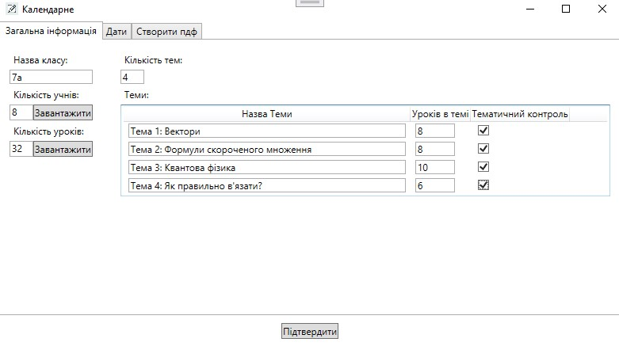
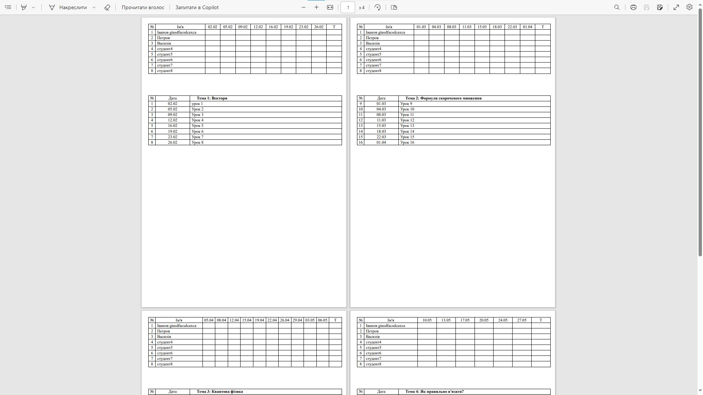

# Teacher Planner

A simple program to create pdf document with tables that represent teachers plan for a semester or year or just one theme. Ukrainian interface.

## How To Use

- First of all you have to get exect number of themes you are going to have during your timeperiod and to calculate number of lessons you will have for each theme;
- than you have to create a list of your students in one file (lets imagine "students.txt");
- and list of lessons in the sepparete file (let it be lessons.txt);
- each list item has to be new line, program ignores blank lines while reading;
- than you can upload those lists to the program;
- next step is to select day of start of your semester and day of its end;
- after that you choose days of study;
- and eddit list of hollidays where there is no study;
- after all that steps done, you may finally specify the output file location and name, and create it;
- **note, you may use submit button any time to check if all numbers are good**.

## Example screenshots

Page 1 after all fields entered and all files uploaded:

Page 2 after all fields entered and all files uploaded:

The look of created pdf document:

## Usings

- C#;
- .NET 8.0;
- WPF;
- QuestPDF.
